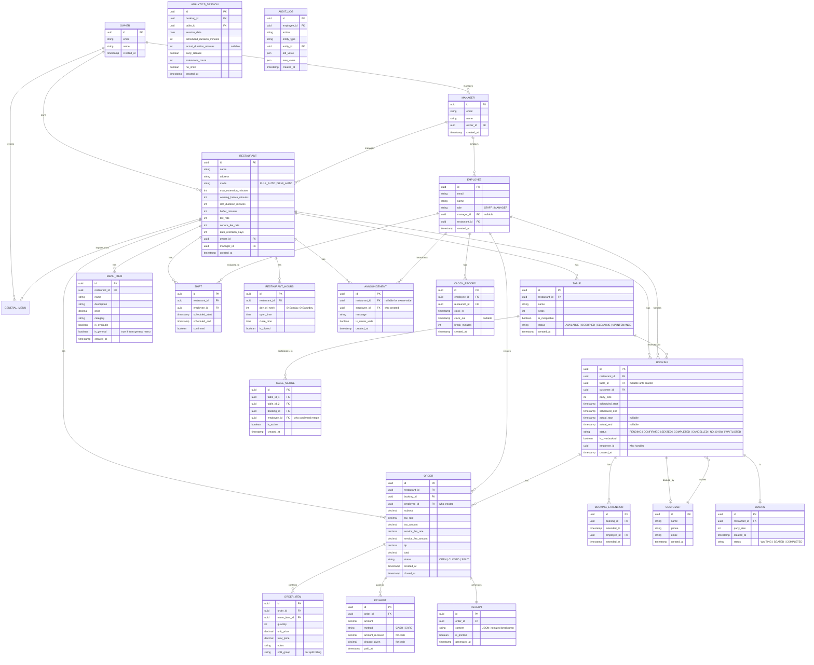

# Digitalising Yori Deggendorf Chain

## Problems

- The current system at this restaurant chain has not been completely digitalised
- The booking system on the current website is not functional
- There is little to no support for customers on the website
- Receipts are done by hand

## Proposed Solution

- An all-in-one web-based system
- Microservice Architecture (Render for frontend, Docker for backend, Firebase for Database)

## Technologies (for now)

- ReactJS for Front-End
- JavaScript/TypeScript for Back-End (to be decided)
- Firebase for storage
- Redis caching

---

## System Architecture

> **Note:** Both the staff-facing management app and customer-facing website are dynamic sites (not static).

### Menu System

- **General Menu**: A master menu shared across the entire chain
- **Restaurant Import**: Each new restaurant automatically imports the general menu items
- **Custom Menu Items**: Each restaurant can add their own menu items in addition to the imported ones
- **Customer Website**: Single website for all restaurants with a **dropdown selector** to switch between restaurants
  - Customers view only the selected restaurant's menu (general + restaurant-specific items)
  - No access to the general menu directly

---

## MoSCoW Feature List

### Must Have

| Feature | Access Level | Notes |
| --- | --- | --- |
| Role-based access | Owner, Manager, Staff, Customer | Full admin (Owner), Limited admin (Manager), Staff, Public (Customer) |
| Login/Logout | Owner, Manager, Staff, Customer | |
| Table management | Owner, Manager, Staff | CRUD (Owner), Status check (Manager), Status update (Staff) |
| Table merging | Manager+ | Always requires employee confirmation |
| Booking system | Owner, Manager, Staff, Customer | 2h slots, 30min buffer, +30% overbooking |
| Walk-in management | Staff+ | Lower priority than pre-bookings |
| Pre-booking priority | System | Waitlisted pre-bookings seated before walk-ins |
| Booking cancellation + rebook | Customer | No modification allowed |
| Auto/Semi-auto mode | Owner+ | Per restaurant setting |
| AI chatbot (booking) | Owner, Customer | Full flow (auto) / Confirm (semi-auto) |
| AI chatbot (support) | Owner, Customer | Toggle on/off (Owner only) |
| Menu management | Manager+ | Restaurant-scoped |
| Order management | Staff+ | Pre-built items, tap to add |
| Order notes | Staff+ | Per item (e.g., "no onions") |
| Split billing | Staff+ | By item |
| Flat tax rate | Manager+ | Configurable |
| Service fee | Manager+ | Configurable |
| Cash payment tracking | Staff+ | Amount received + change given |
| Payment method reporting | Staff+ | Per transaction |
| Receipt (printed) | Staff+ | Itemized, notes, totals, tip, split |
| Receipt saved in system | Manager+ | For records access |
| Daily summary report | Manager+ | Covers, revenue, tips |
| Internal announcements | Owner, Manager | Owner broadcasts to all restaurants |
| Real-time table status board | Staff+ | TV display |
| Search bookings | Staff+ | By name/phone |
| Clock-in/out | Staff+ | Attendance tracking |
| Break tracking | Staff+ | Staff breaks |
| Shift confirmation | Staff | Confirm scheduled shifts |
| Automatic email reminders | System | 24h before booking |
| Wait time estimator | System | Shown when restaurant is full |
| Restaurant hours per day | Manager+ | Configurable per day |
| Slot duration config | Owner+ | Default 2h |
| Buffer duration config | Manager+ | Default 30min, warning only |
| Max extension config | Owner+ | Configurable max |
| Warning timing config | Owner+ | Minutes before slot ends |
| Data retention | Owner+ | Default 30 days, configurable |
| Google Sheets integration | Owner, Manager | Financial data export |
| GDPR compliance | System | Data minimization, right to erasure |

### Should Have

| Feature | Access Level | Notes |
| --- | --- | --- |
| Audit logs | Manager+ | Immutable action logs |
| Staff performance metrics | Manager+ | Tables served, avg order value |
| Daily cash reconciliation | Manager+ | End-of-day cash vs card |

### Could Have

| Feature | Notes |
| --- | --- |
| Automatic tax calculation | Requires expense input for net income |
| Manual tax rate reconfiguration | Emergency override for law changes |
| Kitchen Display System (KDS) | Kitchen order display |
| Inventory management | Stock tracking |
| Staff scheduling optimization | Automated scheduling |
| Predictive analytics | Busy period forecasting |
| Offline mode | For WiFi reliability issues |

### Won't Have

| Feature | Notes |
| --- | --- |
| Floor plan/table visualization | Drag-drop assignment |
| Booking modification | Cancel + rebook only |
| SMS notifications | Future potential |
| Customer mobile app | Future potential |
| Loyalty/rewards program | Future potential |
| QR code self-ordering | Waiters handle orders |

---

## Booking System Rules

| Aspect | Rule |
| --- | --- |
| Slot Duration | 2h default (Owner+ configurable) |
| Buffer Duration | 30min (Manager+ configurable, affects warning only) |
| Overbooking Cap | +30% by table count |
| 11th-13th booking | Silent waitlist |
| 14th+ booking | "All tables full" |
| Seating Priority | Tightest fit (smallest table that fits party) |
| Walk-in Priority | After waitlisted pre-bookings |
| Auto Mode | Full auto (no confirm) / Semi-auto (requires confirm) per restaurant |
| Table Merge | Always requires employee confirmation |
| Early Release | Employee+ can free anytime |
| Extension | Employee+ can extend (max configurable) |
| No-show Release | Auto after buffer (full auto) / Confirm (semi-auto) |
| AI Booking | Full flow (auto) / Confirm before set (semi-auto) |
| Customer Data | Name, phone, email only (no account required) |
| Confirmation | Email only |
| Booking Flow | Customer chooses arrival time only; system assigns slot |

---

## Billing Rules

| Aspect | Rule |
| --- | --- |
| Tax | Flat rate (Manager+ configurable) |
| Service Fee | Manager+ configurable |
| Order Notes | Per item |
| Split Billing | By item |
| Cash Payment | Employee enters amount received + change given |
| Receipt | Printed only for customer; saved in system for Manager+ |

---

## Role Permissions Summary

| Role | Scope | Key Rights |
| --- | --- | --- |
| **Owner** | All restaurants | Full admin, slot config, max extension, warning timing, AI toggle, export financials, data retention, broadcast to all |
| **Manager** | Own restaurant | Hours config, buffer config, mode config, tax rate, service fee, menu CRUD, employee management, table CRUD, approval tasks, daily summary, audit logs |
| **Staff** | Own restaurant | Update table status, create/close orders, process payments, print receipts, mark no-shows, clock-in/out, break tracking, seat customers |
| **Customer** | Public | Book tables, cancel/rebook, receive confirmations, chat with AI support |

---

### ERD (Entity Relationship Diagram)

---

### Data Flow Diagram

```mermaid
flowchart TD
    subgraph External["External Entities"]
        Customer["Customer"]
        Employee["Employee"]
        Owner["Owner"]
    end

    subgraph Processes["Processes"]
        BookingFlow["Booking System"]
        WalkinMgmt["Walk-in Management"]
        TableMgmt["Table Management"]
        OrderMgmt["Order Management"]
        PaymentFlow["Payment Processing"]
        Reporting["Reporting & Analytics"]
        AIAssistant["AI Chatbot"]
        Notifications["Notification Service"]
        StaffMgmt["Staff Management"]
        ClockSystem["Clock In/Out System"]
    end

    subgraph DataStores["Data Stores"]
        DB[(Firebase Database)]
        Cache[(Redis Cache)]
        Sheets[(Google Sheets)]
    end

    Customer -->|"1. Book table request"| BookingFlow
    BookingFlow -->|"2. Check availability"| Cache
    BookingFlow -->|"3. Create booking"| DB
    BookingFlow -->|"4. Confirmation email"| Notifications
    Notifications -->|"5. Email"| Customer

    Customer -->|"6. Chat for support"| AIAssistant
    AIAssistant -->|"7. Query bookings"| DB

    Employee -->|"8. Register walk-in"| WalkinMgmt
    WalkinMgmt -->|"9. Check queue"| DB
    WalkinMgmt -->|"10. Add to queue"| DB

    Employee -->|"11. Seat customers"| TableMgmt
    TableMgmt -->|"12. Assign table"| DB
    TableMgmt -->|"13. Update status"| Cache

    Employee -->|"14. Clock in/out"| ClockSystem
    ClockSystem -->|"15. Record time"| DB

    Employee -->|"16. View table status"| TableMgmt
    TableMgmt -->|"17. Get status"| Cache

    Employee -->|"18. Take order"| OrderMgmt
    OrderMgmt -->|"19. Save order"| DB

    Employee -->|"20. Close bill"| PaymentFlow
    PaymentFlow -->|"21. Record payment"| DB
    PaymentFlow -->|"22. Generate receipt"| DB
    PaymentFlow -->|"23. Print receipt"| Employee

    Manager -->|"24. Create announcement"| StaffMgmt
    StaffMgmt -->|"25. Broadcast"| DB
    StaffMgmt -->|"26. Notify"| Employee

    Owner -->|"27. View analytics"| Reporting
    Reporting -->|"28. Export data"| Sheets

    TableMgmt -->|"29. Update analytics"| DB
    BookingFlow -->|"30. Log session"| DB
    BookingFlow -->|"31. Log audit"| DB
```

---

### Use Case Diagram

```mermaid
graph LR
    subgraph Customer["Customer"]
        UC1[Book Table]
        UC2[Cancel and Rebook]
        UC3[Chat with AI Support]
        UC4[Receive Confirmation Email]
        UC5[Receive Printed Receipt]
    end

    subgraph Staff["Staff"]
        UC10[Log In/Out]
        UC11[Clock In/Out]
        UC12[Start Break / End Break]
        UC13[Confirm Shift]
        UC14[View Table Status]
        UC15[Seat Customers]
        UC16[Free Table Early]
        UC17[Extend Booking]
        UC18[Register Walk-in]
        UC19[Create Order]
        UC20[Add Order Item]
        UC21[Add Order Notes]
        UC22[Split Bill by Item]
        UC23[Process Payment]
        UC24[Enter Cash Amount & Change]
        UC25[Print Receipt]
        UC26[Mark No-Show]
    end

    subgraph Manager["Manager"]
        UC30[Log In/Out]
        UC31[Configure Restaurant Hours]
        UC32[Configure Buffer Duration]
        UC33[Configure Tax Rate]
        UC34[Configure Service Fee]
        UC35[Set Auto/Semi-Auto Mode]
        UC36[Configure Slot Duration]
        UC37[Configure Max Extension]
        UC38[Configure Warning Timing]
        UC39[Configure Data Retention]
        UC40[CRUD Menu Items]
        UC41[CRUD Tables]
        UC42[Approve Table Merge]
        UC43[Approve Auto-Seating]
        UC44[Approve Early Release]
        UC45[Approve AI Booking]
        UC46[View Daily Summary]
        UC47[View Audit Logs]
        UC48[Manage Employees]
        UC49[Create Announcement]
        UC50[View Staff Performance]
        UC51[Export to Google Sheets]
    end

    subgraph Owner["Owner"]
        UC60[Log In/Out]
        UC61[Manage All Restaurants]
        UC62[View All Analytics]
        UC63[Export Financial Data]
        UC64[Toggle AI Support]
        UC65[Set AI Booking Mode]
        UC66[Configure Data Retention]
        UC67[Broadcast to All Restaurants]
    end

    classDef actor fill:#f9f,stroke:#333,stroke-width:2px
    classDef usecase fill:#bbf,stroke:#333,stroke-width:1px

    class Customer,Staff,Manager,Owner actor
```

---

## Non-Functional Requirements

| Category | Requirement |
| --- | --- |
| **Performance** | Support ~1000 concurrent users (staff + customers) |
| **Real-time** | WebSocket via Firebase Realtime DB |
| **Security** | GDPR compliance, PCI compliance for payments |
| **Session** | JWT with short expiry + refresh token rotation |
| **Audit** | Immutable action logs for all admin operations |
| **Data Retention** | 30 days default (owner-configurable) |
| **Availability** | Target 99.9% uptime |
| **Scalability** | Stateless backend for horizontal scaling |

---

## Data Retention Policy

- Customer booking data: 30 days (owner-configurable)
- Audit logs: 1 year
- Financial records: Per local regulations
- Auto-deletion of customer PII after retention period